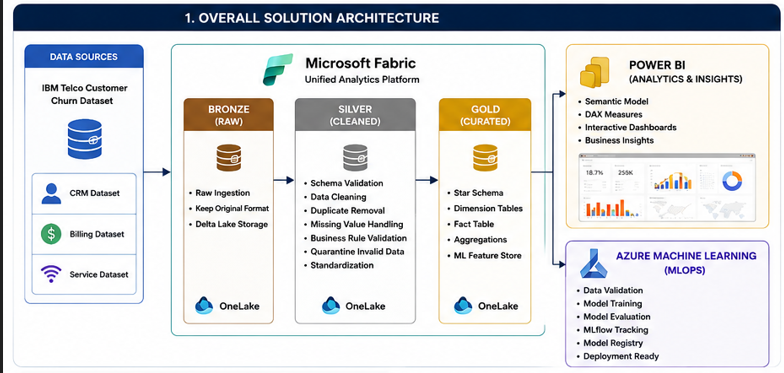

# 🚀 Telecom Customer Churn Analytics & Prediction Platform

<p align="center">


</p>

---

## 📌 Project Overview

This project implements an **end-to-end cloud-native Telecom Customer Churn Analytics and Prediction Platform** using **Microsoft Fabric**, **Azure Machine Learning**, **Power BI**, **PySpark**, and **MLflow**.

The solution demonstrates a complete modern analytics workflow—from raw data ingestion through governed data engineering, dimensional modeling, business intelligence, machine learning, and cloud-based MLOps.

Unlike traditional churn prediction projects that focus only on model training, this project recreates an enterprise analytics platform where raw operational data is transformed into business-ready insights and production-oriented machine learning pipelines.

---

## 🎯 Business Problem

Telecommunication providers lose significant revenue due to customer churn.

Organizations often possess large amounts of CRM, billing, and service usage data, but struggle to transform these disconnected datasets into actionable business insights and predictive intelligence.

This project addresses that challenge by building a unified analytics platform capable of:

- Identifying customers at risk of churn
- Producing business-ready analytical datasets
- Delivering executive dashboards
- Training and evaluating machine learning models
- Demonstrating cloud-native MLOps practices

---

## ✨ Key Features

✅ Bronze–Silver–Gold Medallion Architecture

✅ Data Quality Validation Framework

✅ Business Rule Validation

✅ Quarantine Tables

✅ Delta Lake Storage

✅ Star Schema Design

✅ Semantic Model

✅ Interactive Power BI Dashboard

✅ Machine Learning Model Comparison

✅ Feature Engineering

✅ Azure Machine Learning

✅ MLflow Experiment Tracking

✅ Reproducible Cloud Training Pipeline

---

# 🏗 Solution Architecture



                    IBM Telecom Dataset
                           │
          ┌────────────────┼────────────────┐
          │                │                │
          ▼                ▼                ▼
     CRM Dataset     Billing Dataset   Service Dataset
          │                │                │
          └───────────────┬─────────────────┘
                          ▼
                 Microsoft Fabric OneLake
                          │
                    Bronze Lakehouse
                          │
                          ▼
                    Silver Lakehouse
             Data Cleaning & Validation
           Schema Drift | Business Rules
             Duplicate Removal | Quarantine
                          │
                          ▼
                     Gold Lakehouse
                 Star Schema & Features
                          │
          ┌───────────────┴────────────────┐
          ▼                                ▼
     Power BI Dashboard           Azure Machine Learning
                                         │
                                  Data Validation
                                         │
                                  Model Training
                                         │
                                  Model Evaluation
                                         │
                                        MLflow
                                         │
                                  Model Registry

---

# 🛠 Technology Stack

| Layer | Technologies |
|---------|----------------|
| Data Engineering | Microsoft Fabric, PySpark, Delta Lake |
| Storage | OneLake |
| Data Modeling | Star Schema |
| Analytics | Power BI |
| Machine Learning | Scikit-learn, XGBoost, CatBoost |
| Cloud ML | Azure Machine Learning |
| Experiment Tracking | MLflow |
| Programming | Python |
| Version Control | Git & GitHub |

---

# 📂 Repository Structure

```text
telecom-customer-churn-analytics-mlops/

├── data/
├── docs/
├── fabric/
├── machine-learning/
├── azure-ml/
├── power-bi/
├── README.md
```

---

# 🔄 End-to-End Workflow

IBM Telecom Dataset

↓

CRM • Billing • Service datasets

↓

Microsoft Fabric

↓

Bronze Layer

↓

Silver Layer

↓

Gold Layer

↓

┌──────────────┴──────────────┐

↓

Power BI Azure ML

↓

Interactive Dashboard ML Pipeline

↓

MLflow

↓

Model Registry

---

# 📊 Microsoft Fabric

### Bronze Layer

Raw CRM, Billing, and Service datasets are ingested into Microsoft Fabric OneLake while preserving the original data.

### Silver Layer

The Silver layer performs:

- Schema validation
- Duplicate removal
- Missing value handling
- Category standardization
- Business rule validation
- Quarantine processing

### Gold Layer

The Gold layer contains:

- Fact Customer Churn
- Customer Dimension
- Geography Dimension
- Contract Dimension
- Service Dimension

using a Star Schema optimized for analytics and machine learning.

                 Dim Customer
                      │
                      │
Dim Geography ─── Fact Customer Churn ─── Dim Service
                      │
                      │
               Dim Contract


---

# 🤖 Machine Learning

Multiple machine learning models were evaluated to predict customer churn.

Models include:

- Logistic Regression
- Random Forest
- XGBoost
- CatBoost

Evaluation focused on:

- Recall
- F1-score
- ROC-AUC
- PR-AUC

rather than accuracy due to class imbalance.

---

# ☁ Azure Machine Learning

The curated Gold dataset is used to demonstrate cloud-native machine learning workflows.

Implemented components include:

- Azure ML Workspace
- Data Validation
- Training Script
- Evaluation Script
- Environment Configuration
- MLflow Logging
- Azure ML Jobs

---

# 📈 Power BI Dashboard

Interactive dashboards provide business insights including:

- Customer Churn Rate
- Customer Segmentation
- Contract Analysis
- Service Analysis
- Payment Method Analysis
- Customer Demographics

---

# 📷 Project Gallery

Architecture

*(Insert screenshot)*

Fabric

*(Insert screenshot)*

Power BI

*(Insert screenshot)*

Azure Machine Learning

*(Insert screenshot)*

---


# 🚀 Future Improvements

- CI/CD using GitHub Actions
- Automated Retraining
- Azure ML Pipelines
- Online Endpoints
- Model Monitoring
- Data Drift Detection
- Real-time Scoring API

---

# 👨‍💻 Author

**Supul Wickramasinghe**

BSc (Hons) Data Science

University of Colombo

LinkedIn: https://www.linkedin.com/in/supul-wickramasinghe

GitHub: https://github.com/supulwickramasinghe