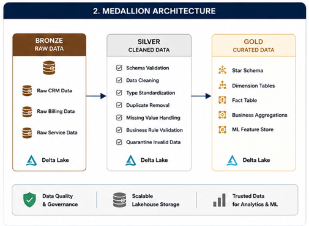
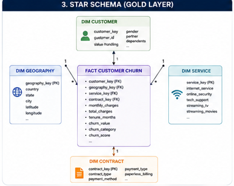

# 🏗 Microsoft Fabric Data Engineering

## Overview

The Microsoft Fabric implementation forms the data engineering foundation of the Telecom Customer Churn Analytics & Prediction Platform.

The solution follows the **Medallion Architecture (Bronze → Silver → Gold)** to transform raw telecom customer data into trusted analytical datasets that support business intelligence and machine learning.

---

# Architecture



---

# Objectives

- Build a scalable cloud-native data engineering pipeline
- Separate raw and curated datasets
- Improve data quality through reusable validation logic
- Preserve invalid records for auditing
- Create a business-ready star schema
- Generate machine learning features

---

# Source Data

The original IBM Telecom dataset was separated into three independent business domains.

| Dataset | Description |
|----------|-------------|
| CRM | Customer demographic and contract information |
| Billing | Charges, payment information |
| Service | Internet, phone and subscription services |

This separation simulates real enterprise systems where customer information originates from multiple operational databases.

---

# Bronze Layer

The Bronze layer stores raw source data exactly as received.

### Responsibilities

- Raw ingestion
- Schema preservation
- Historical storage
- No transformations

Stored datasets

- CRM
- Billing
- Service

---

# Silver Layer

The Silver layer performs all data quality operations.

## Data Cleaning

Implemented transformations include

- Schema validation
- Type conversion
- Duplicate removal
- Missing value handling
- Category normalization
- String standardization
- Business rule validation

---

## Business Rule Validation

The pipeline validates several business constraints.

Examples include

- Negative tenure values
- Negative monthly charges
- Invalid churn values
- Missing critical fields
- Invalid categorical values

Rows violating business rules are excluded from curated datasets.

---

## Quarantine Framework

Instead of deleting invalid records, they are stored in dedicated quarantine tables.

Benefits

- Full audit trail
- Easier debugging
- Data governance
- Repeatable quality assurance

---

# Gold Layer

The Gold layer contains analytics-ready dimensional models.

Implemented tables

- Fact Customer Churn
- Dimension Customer
- Dimension Geography
- Dimension Contract
- Dimension Service

These tables are optimized for Power BI and machine learning.

---

# Star Schema



The Gold layer follows a classic dimensional model using surrogate keys and one-to-many relationships between dimensions and the central fact table.

---

# Feature Engineering

Machine-learning-ready features are generated from the Gold layer.

Examples

- Customer tenure
- Monthly charges
- Total charges
- Contract type
- Internet service
- Payment method
- Customer demographics

The curated dataset is exported for Azure Machine Learning.

---

# Technologies

- Microsoft Fabric
- PySpark
- Delta Lake
- OneLake
- Lakehouse
- SQL Endpoint

---

# Folder Structure

```

fabric/
│
├── notebooks/
│ ├── 01_bronze_to_silver_data_processing.ipynb
│ ├── 02_silver_to_gold_star_schema.ipynb
│ └── 03_ml_feature_engineering.ipynb
│
├── screenshots/
│
└── README.md

```

---

# Skills Demonstrated

- Cloud Data Engineering
- ETL Pipeline Development
- Medallion Architecture
- Delta Lake
- Data Quality Framework
- Business Rule Validation
- Dimensional Modeling
- Feature Engineering
- Data Governance