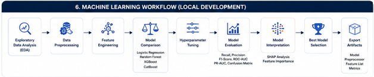

# 🤖 Machine Learning

## Overview

This module contains the complete machine learning lifecycle for predicting telecom customer churn.

Unlike a conventional notebook that trains a single model, this workflow follows a structured experimentation process including exploratory data analysis, preprocessing, feature engineering, model comparison, imbalance handling, hyperparameter optimization, model interpretation, and model persistence.

The final curated dataset generated from Microsoft Fabric is used as the input for all experiments before being operationalized in Azure Machine Learning.

---

# Machine Learning Workflow



---

# Objectives

The primary objective of this workflow is to develop an accurate and interpretable customer churn prediction model capable of identifying customers at high risk of leaving while minimizing false negatives.

The workflow was designed to

- understand customer behaviour
- discover churn drivers
- compare multiple machine learning algorithms
- handle severe class imbalance
- optimize predictive performance
- explain model decisions
- prepare production-ready models

---

# Workflow Overview

```
Clean Dataset

↓

Exploratory Data Analysis

↓

Feature Engineering

↓

Train/Test Split

↓

Preprocessing Pipeline

↓

Baseline Models

↓

Imbalance Handling

↓

Cross Validation

↓

Hyperparameter Optimization

↓

Model Interpretation

↓

Model Export

↓

Azure Machine Learning
```

---

# Exploratory Data Analysis

EDA was performed to understand customer behaviour before model development.

The analysis includes

### Data Understanding

- Dataset inspection
- Data types
- Missing values
- Duplicate detection
- Descriptive statistics

### Target Variable Analysis

- Churn distribution
- Churn percentage
- Class imbalance visualization

### Univariate Analysis

Visualizations were created for

- Tenure
- Monthly Charges
- Total Charges

and all categorical variables.

### Bivariate Analysis

Customer churn was analysed against

- Contract Type
- Internet Service
- Payment Method
- Gender
- Senior Citizen
- Partner
- Dependents
- Multiple Lines
- Online Security
- Device Protection
- Tech Support
- Streaming Services

### Multivariate Analysis

Relationships between numerical variables were analysed using

- Correlation Matrix
- Scatter Plots
- Heatmaps

### Outlier Detection

Outliers were analysed across numerical variables to understand abnormal customer behaviour.

---

# Data Preparation

Several preprocessing steps were performed before model training.

## Data Cleaning

- Missing value handling
- Data type correction
- Removal of duplicate records

## Feature Selection

Potential leakage variables were removed before training.

Removed variables include

- Customer ID
- Churn Score
- CLTV
- Churn Reason

to ensure realistic model performance.

---

# Feature Engineering

The preprocessing pipeline automatically performs

### Numerical Features

- Median Imputation
- Standard Scaling

### Categorical Features

- Missing Value Imputation
- One-Hot Encoding

The preprocessing pipeline is fully integrated into the model pipeline to eliminate data leakage.

---

# Train/Test Split

The dataset is divided using a stratified train-test split.

Benefits include

- preserving churn distribution
- unbiased evaluation
- reproducible experiments

---

# Models Evaluated

The following supervised learning algorithms were compared.

| Algorithm |
|-----------|
| Logistic Regression |
| Random Forest |
| XGBoost |
| CatBoost |

Each model was evaluated under multiple sampling strategies.

---

# Handling Class Imbalance

Customer churn is an imbalanced binary classification problem.

Instead of relying on a single approach, four independent strategies were evaluated.

## 1. Baseline Models

No imbalance correction.

Purpose

Establish benchmark performance.

---

## 2. Class Weight Models

Algorithms were configured to penalize minority-class errors.

Implemented for

- Logistic Regression
- Random Forest
- XGBoost
- CatBoost

---

## 3. SMOTE Oversampling

Synthetic Minority Oversampling Technique (SMOTE) was applied to generate synthetic churn examples before training.

---

## 4. Random Undersampling

Majority-class observations were randomly reduced to balance the dataset.

---

# Model Evaluation

Each experiment was evaluated using

- Accuracy
- Precision
- Recall
- F1 Score
- ROC-AUC
- PR-AUC

Because customer churn is highly imbalanced, the project prioritizes

- Recall
- PR-AUC
- F1 Score

rather than overall accuracy.

---

# Cross Validation

The best-performing pipelines were further validated using cross-validation to evaluate their robustness across multiple training folds.

This reduces the likelihood of overfitting and provides a more reliable estimate of real-world performance.

---

# Hyperparameter Optimization

The highest-performing models were further optimized using hyperparameter tuning.

Optimization was performed to improve

- Recall
- F1 Score
- PR-AUC

while maintaining good generalization performance.

---

# Model Explainability

To improve transparency and business interpretability, explainability techniques were applied.

Implemented methods include

## Feature Importance

Ranks the variables that contribute most to customer churn predictions.

## SHAP Analysis

SHAP values explain

- feature contributions
- local predictions
- global model behaviour

making the final model easier to interpret for business stakeholders.

---

# Model Persistence

The selected model is exported for deployment.

Saved artifacts include

- Trained Model
- Pipeline
- Evaluation Metrics
- Classification Report

The production workflow continues in Azure Machine Learning where cloud-based validation, training, evaluation, MLflow tracking, and model registration are performed.

---

# Technologies

- Python
- Pandas
- NumPy
- Scikit-learn
- XGBoost
- CatBoost
- Imbalanced-learn
- SHAP
- Matplotlib
- Seaborn

---

# Folder Structure

```
machine-learning/

├── notebooks/
│   ├── 01_exploratory_data_analysis.ipynb
│   └── 02_model_training_and_evaluation.ipynb
│
└── README.md
```

---

# Business Value

The machine learning workflow enables proactive identification of customers at risk of churn, allowing organizations to prioritize customer retention campaigns, reduce revenue loss, improve customer lifetime value, and support data-driven decision-making through explainable and reproducible predictive models.

---

# Skills Demonstrated

- Exploratory Data Analysis
- Feature Engineering
- Predictive Modeling
- Imbalanced Classification
- Machine Learning Pipelines
- Model Selection
- Hyperparameter Optimization
- Cross Validation
- Explainable AI (SHAP)
- Model Evaluation
- Production-ready ML Workflow